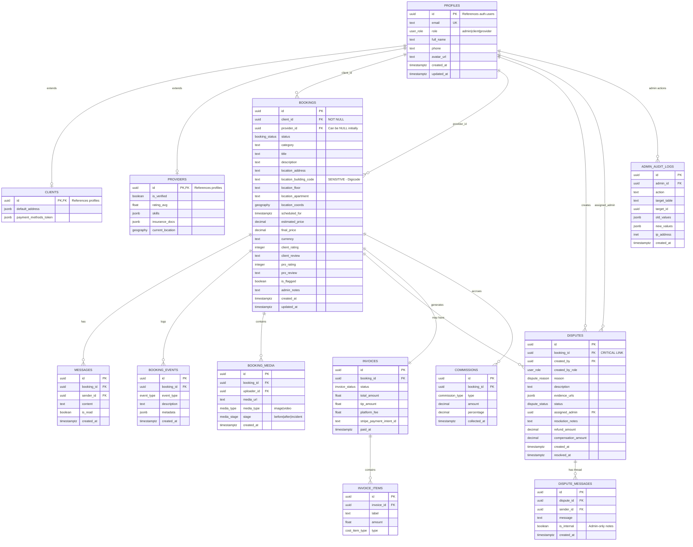

# Beed - Database Entity Relationship Diagram

## Architecture Overview

```
┌─────────────────────────────────────────────────────────────────────────────┐
│                           UNIFIED DATABASE                                   │
│                                                                             │
│  ┌─────────────┐      ┌─────────────┐      ┌─────────────┐                 │
│  │   CLIENT    │      │   BOOKING   │      │     PRO     │                 │
│  │    APP      │◄────►│   (PIVOT)   │◄────►│    APP      │                 │
│  └─────────────┘      └──────┬──────┘      └─────────────┘                 │
│                              │                                              │
│                              ▼                                              │
│                       ┌─────────────┐                                       │
│                       │    ADMIN    │                                       │
│                       │  DASHBOARD  │                                       │
│                       └─────────────┘                                       │
└─────────────────────────────────────────────────────────────────────────────┘
```

## ERD Diagram (Mermaid)



## Data Flow per Interface

### 1. Client App Flow
```
CLIENT ──► creates BOOKING ──► receives MESSAGES ──► can open DISPUTE
                │
                └──► views PRO (public info only)
```

### 2. Pro App Flow
```
PRO ──► accepts BOOKING ──► sees ADDRESS (only if confirmed)
                │                    │
                │                    └──► sees DIGICODE (only if en_route)
                │
                └──► sends MESSAGES ──► uploads MEDIA (before/after)
```

### 3. Admin Dashboard Flow
```
ADMIN ──► sees ALL BOOKINGS (full data)
    │
    ├──► manages DISPUTES ──► sees full TIMELINE
    │         │
    │         └──► accesses BOOKING_MEDIA as evidence
    │
    ├──► views COMMISSIONS per booking
    │
    └──► all actions logged in ADMIN_AUDIT_LOGS
```

## SQL Views Summary

| View Name | Target Interface | Data Visibility |
|-----------|------------------|-----------------|
| `view_client_bookings` | Client App | Pro public info, own address, own ratings |
| `view_pro_bookings` | Pro App | Client address (if confirmed), digicode (if en_route) |
| `view_admin_bookings` | Admin Dashboard | ALL data: financials, disputes, logs, media |
| `view_admin_disputes` | Admin Dashboard | Full dispute context with booking timeline |

## Key Security Rules

1. **Digicode Protection**: Only visible when `status IN ('en_route', 'in_progress', 'completed')`
2. **Client Address**: Only visible to Pro when `status IN ('accepted', 'en_route', 'in_progress', 'completed')`
3. **Financial Data**: Only visible to Admin role
4. **Audit Logs**: All admin actions are automatically logged
5. **RLS Policies**: Each table has Row Level Security based on user role

## Dispute → Booking Relationship

```sql
-- Admin can access full booking context from any dispute
SELECT 
    d.*,
    b.*,  -- Full booking data
    (SELECT json_agg(e.*) FROM booking_events e WHERE e.booking_id = d.booking_id) AS timeline,
    (SELECT json_agg(m.*) FROM booking_media m WHERE m.booking_id = d.booking_id) AS media
FROM disputes d
JOIN bookings b ON d.booking_id = b.id
WHERE d.id = 'dispute-uuid';
```

This allows admin to see the complete history of a mission when investigating a dispute.
